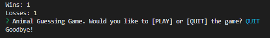

## Constructor-Word-Guess

#### Constructor-Word-Guess is a hangman style game where the player is presented with a number of blanks corresponding to the letters of animal names to be guessed. The play is allowed 10 guesses to figure out what the word is. If the player guesses all the letters correctly, it's a win. If the player exhausts the number of guesses, it's a loss. The number of wins and losses persists until the player exits the game.

#### The game utilizes javascript and node.js technologies. There are three javascript files that control game play: letter.js which contains a constructor, Letter, which either displays an underlying character or a blank placeholder depending on whether or not the user has guessed the letter; word.js which contains a constructor, Word that depends on the Letter constructor in letter.js that is used to create an object representing the current word; index.js which contains logic for the course of the game and depends on word.js being imported.

#### The player must download the code to their computer. The player must then navigate to the folder where the game was saved and then open a bash shell. To run the game the player types 'node index.js' and chooses option 1. The player may choose to play or exit the game.

#### The player is then presented with blanks. that will be filled in if the player guesses correctly.

####  If the player guesses correctly, the blank is filled in.

#### When a player guesses all the letter correctly, a win message is displayed along with the word and number of wins and losses. The player is asked if they wish to play again or exit the game.

#### When a player guesses all the letter correctly, a win message is displayed along with the word, the number of wins and losses, and option to play or leave the game.

#### The player is presented with a message upon exiting the game.

#### The game was developed by Ron Johnson as the sole contributor.